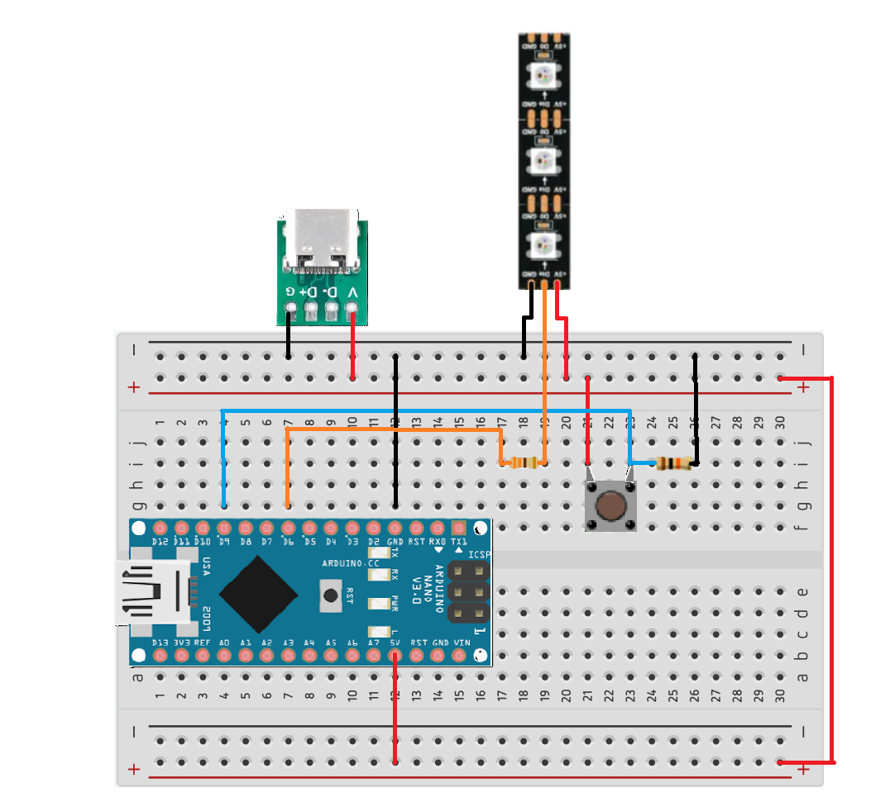
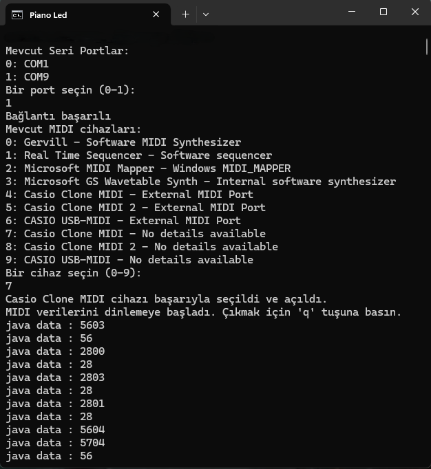

# 🎹 Piano LED Project

Dieses Projekt visualisiert MIDI-Daten von einem digitalen Klavier mit modernem USB-B-Anschluss über Java auf dem Computer und steuert adressierbare LEDs über ein Arduino.  

---

## 📌 Projektübersicht

**Verbindung:**  
E-Piano → USB-MIDI → Computer (Java liest MIDI-Daten) → USB → Arduino  

**Funktionsweise:**  
- MIDI-Nachrichten werden am Computer in Java verarbeitet.  
- Noten- und Velocity-Werte werden extrahiert und über USB an das Arduino gesendet.  
- Das Arduino interpretiert die Daten und schaltet die entsprechenden LEDs ein oder aus, inklusive Effekte.  

**Datenfluss:**  
E-Piano: MIDI-MSG (USB) → Computer: Noten- & Velocity-Werte (USB) → Arduino

**Ausgabe:**  
- Arduino steuert LEDs an und aus.  
- Zusätzliche Effekte sind implementiert.  

**Ergebnis:**  
- Die gespielte Musik wird durch Licht visuell dargestellt.  

---

## 🛠 Verwendete Technologien und Bibliotheken

- **Computer & Java** (MIDI-Verarbeitung)  
- **Arduino & C/C++** (LED-Steuerung)  
- **jSerialComm-2.11.0** (Java MIDI-Bibliothek)  
- **Adafruit_NeoPixel** (Arduino LED-Bibliothek)  

---

## 🔌 Hardware-Anforderungen

- Digitales Klavier MIDI USB-Type-B Ausgang ("Casio Celviano AP-260")  
- USB-B zu USB-A/C Kabel  
- Arduino Nano + USB-Kabel  
- WS2812B 5V 176 LEDs (1 m, 144 LEDs/m) + 330 Ω Widerstand  
- Taster + 10 kΩ Widerstand  
- USB-C Stromversorgung (5 V)  

*Hinweis: Taster und Widerstand optional für zusätzliche Effekte.*  

---

## 🚀 Installation & Ausführung

1. `ArduinoController.jar`, `lib`-Ordner und `run.bat` herunterladen  
2. Arduino an die LED-Streifen anschließen und Software hochladen  
   > ⚠️ **Arduino-Code ist nicht enthalten; bitte per E-Mail anfragen.**  
3. E-Piano mit Computer verbinden  
4. `run.bat` ausführen → COM-Ports werden angezeigt → Arduino COM auswählen  
5. MIDI-Geräte werden angezeigt → E-Piano auswählen  
6. LEDs reagieren auf gespielte Noten; Noten- & Velocity-Werte erscheinen in der Konsole  

---

## 📸 Schaltplan & Projektbilder

  
  
  
  

---

## 📄 Lizenz / Hinweis

Dieses Repository dient **nur der Projektpräsentation**.  
**Quellcode ist nicht enthalten. Arduino-Code bitte per E-Mail anfragen.**  

--- ## ✨ Entwickler 

**Name:** Mehmet Özdemir 
**GitHub:** [https://github.com/mehmetoziron](https://github.com/mehmetoziron)
